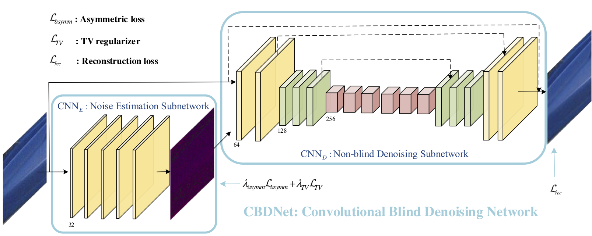

# CBDNet-pytorch

An unofficial implementation of CBDNet by PyTorch.

[CBDNet in MATLAB](https://github.com/GuoShi28/CBDNet)

[CBDNet in Tensorflow](https://github.com/IDKiro/CBDNet-tensorflow)

## Quick Start

Download the [dataset](https://zjueducn-my.sharepoint.com/:u:/g/personal/3140103306_zju_edu_cn/Ec0R2eTtC81Is0KvC5mbomsBw2oJ_oV7jahe1srpgVufcQ?e=aFIc7h) and decompression the files to `dataset`, and then download the pretrained [model](https://zjueducn-my.sharepoint.com/:u:/g/personal/3140103306_zju_edu_cn/EXJF791Lo3lMmn7yQiXjMRoB74QYhR97BaL1yZnLoNLJIA?e=OPgck0) and remove it to `checkpoint` folder as follow:


Train the model on synthetic noisy images :

```
python train_syn.py
```

Train the model on real noisy images:

```
python train_real.py
```

Test the trained model on DND dataset:

```
python test.py
```

*The images in DND dataset is very large, if your GPU is not powerfull enough, just uncomment the following line:*

```python
# noisy_img = noisy_img[0:512, 0:512, :]
```

## Network Structure



## Realistic Noise Model
Given a clean image `x`, the realistic noise model can be represented as:

)))

=n_s(\\textbf{L})+n_c)

Where `y` is the noisy image, `f(.)` is the CRF function and the irradiance ) , `M(.)` represents the function that convert sRGB image to Bayer image and `DM(.)` represents the demosaicing function.

If considering denosing on compressed images, 

))))

## Result


